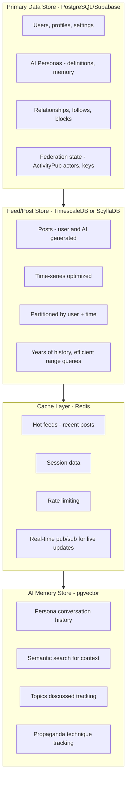
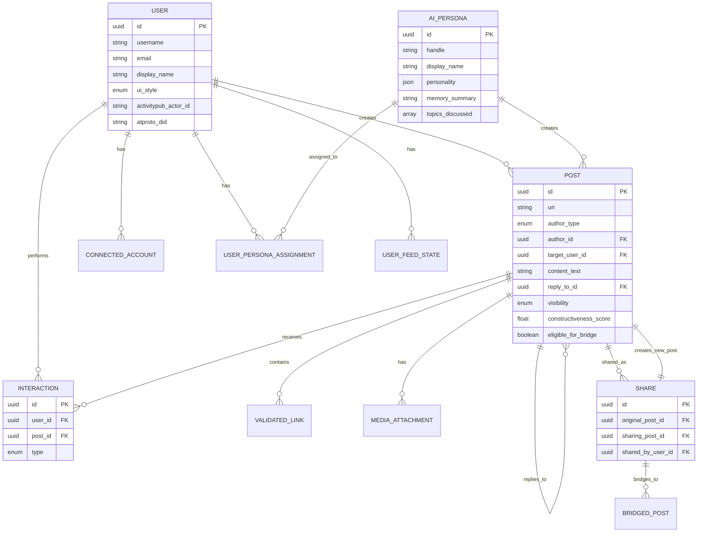
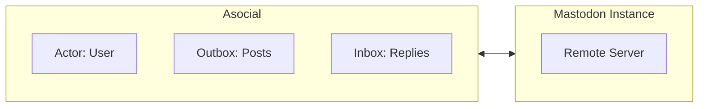
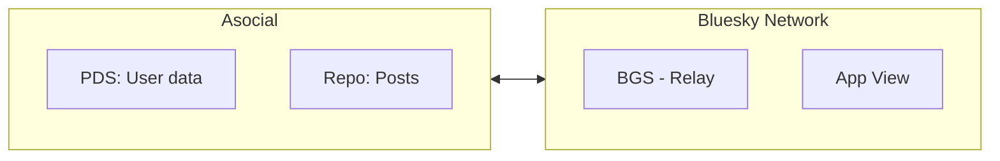
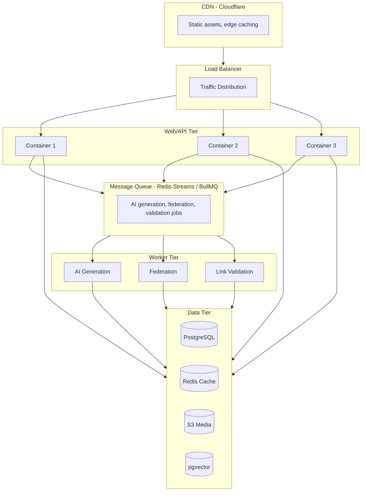
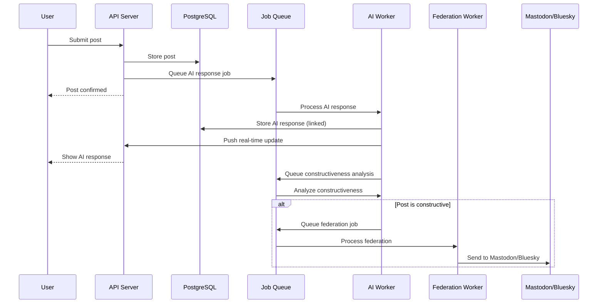
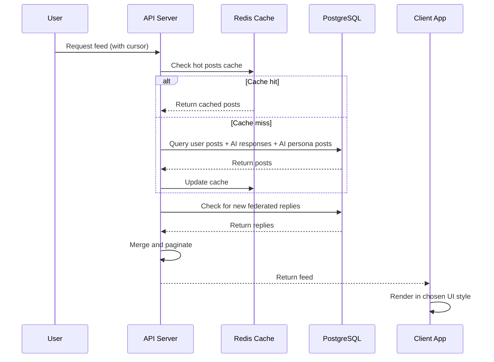
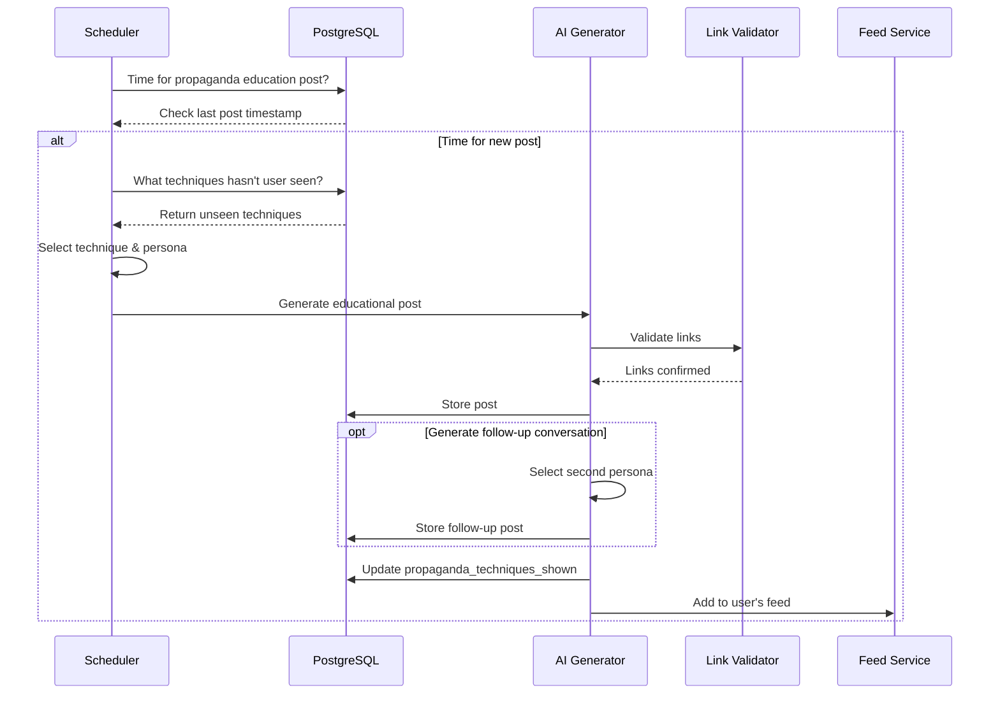
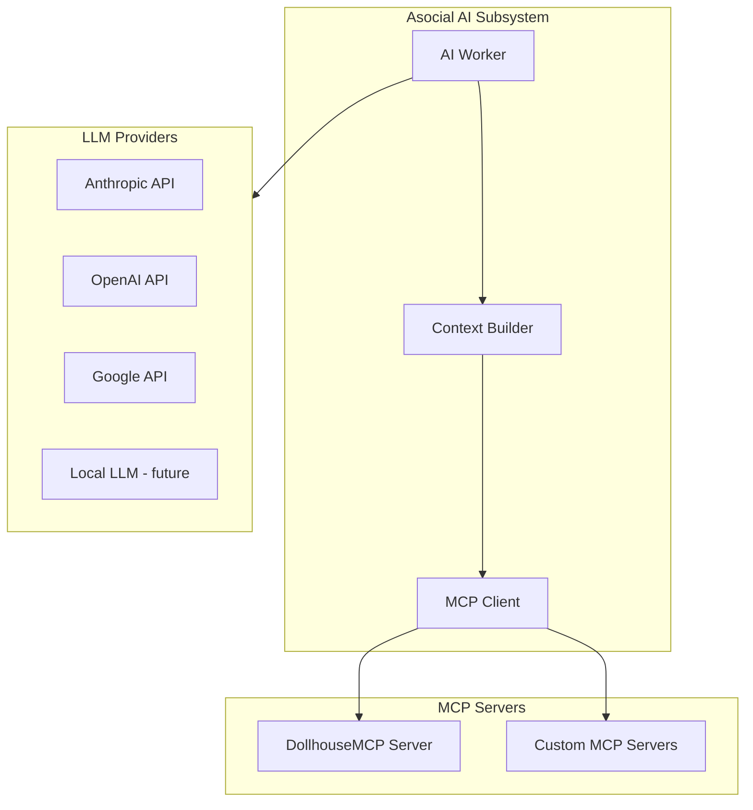
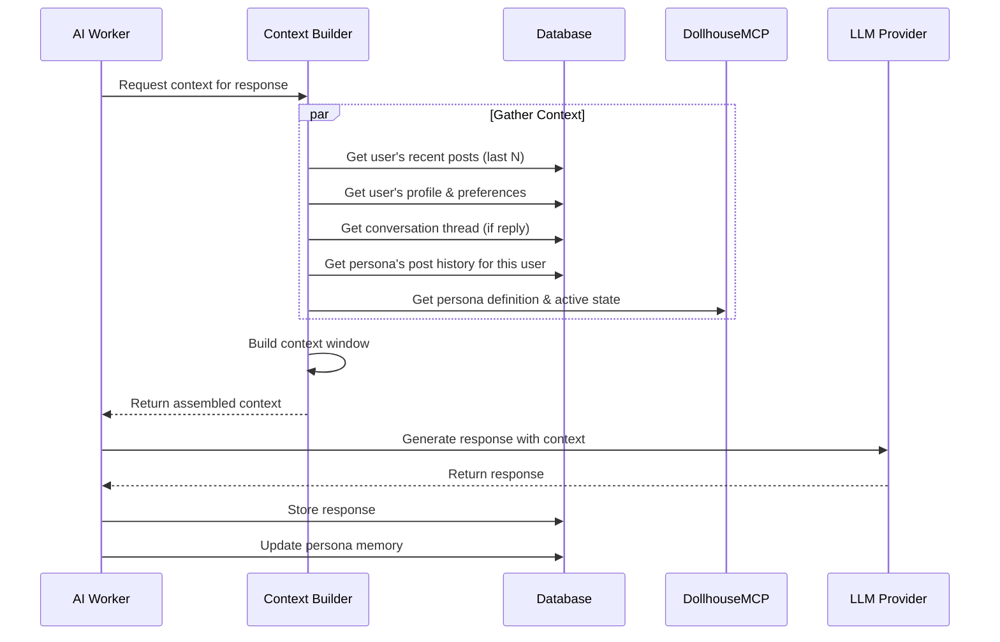

# Technical Design: Data Model & Architecture

## Constraints

- **Hosted** - Cloud-based, not local
- **Mobile-first** - Must work on phones, tablets, desktop
- **Federated** - Compatible with ActivityPub (Mastodon) and AT Protocol (Bluesky)
- **Persistent History** - Years of feed data per user
- **Per-User AI Content** - Unique AI personas/content per user feed

## Data Model Options

### Database Choices

| Option | Pros | Cons | Good For |
|--------|------|------|----------|
| **PostgreSQL** | Battle-tested, JSONB flexibility, what Mastodon uses, great tooling | Scaling writes can be tricky | Core relational data, ActivityPub compatibility |
| **Supabase** | PostgreSQL + real-time + auth + edge functions, fast MVP | Vendor lock-in, cost at scale | Rapid development, real-time feeds |
| **PlanetScale** | Serverless MySQL, horizontal scaling, branching | MySQL not Postgres, no foreign keys | High-scale writes, serverless |
| **CockroachDB** | Distributed Postgres-compatible, global scale | Complexity, cost | Multi-region, high availability |
| **MongoDB** | Flexible schema, document model fits posts | Weaker consistency, joins are awkward | Rapid prototyping, variable schemas |
| **ScyllaDB/Cassandra** | Extreme write throughput, time-series friendly | Complex operations, eventual consistency | Feed storage at massive scale |

### Recommended: Hybrid Approach



## Core Data Models

### Entity Relationship Diagram



### User
```typescript
interface User {
  id: UUID
  username: string
  email: string
  display_name: string
  avatar_url: string
  bio: string

  // Preferences
  ui_style: 'twitter' | 'facebook' | 'instagram' | 'tiktok'

  // Federation
  activitypub_actor_id: string      // e.g., https://asocial.social/users/alice
  atproto_did: string               // e.g., did:plc:abc123

  // Connected external accounts
  connected_accounts: ConnectedAccount[]

  created_at: timestamp
  updated_at: timestamp
}

interface ConnectedAccount {
  platform: 'twitter' | 'mastodon' | 'bluesky' | 'instagram' | 'threads'
  instance_url?: string             // For Mastodon instances
  handle: string
  access_token: encrypted_string
  auto_share_constructive: boolean  // Auto-share qualifying posts
}
```

### Post
```typescript
interface Post {
  id: UUID
  uri: string                       // Canonical URI for federation

  // Authorship
  author_type: 'user' | 'ai_persona'
  author_id: UUID                   // User ID or AI Persona ID

  // For AI posts - which user's feed is this for?
  // NULL for user posts (visible to all who follow)
  // Set for AI posts (only visible to this user)
  target_user_id: UUID | null

  // Content
  content_text: string
  content_html: string              // Rendered with links, mentions
  media_attachments: MediaAttachment[]
  links: ValidatedLink[]

  // Threading
  reply_to_id: UUID | null
  thread_root_id: UUID | null

  // Metadata
  post_type: 'original' | 'share' | 'quote' | 'reply'
  visibility: 'private' | 'followers' | 'public' | 'federated'

  // Constructiveness (for user posts)
  constructiveness_score: float | null
  constructiveness_analysis: string | null
  eligible_for_bridge: boolean

  // AI-specific metadata
  ai_generation_context?: {
    prompt_category: 'response' | 'original' | 'propaganda_education' | 'news' | 'community'
    propaganda_technique?: string   // If educational post
  }

  // Federation
  activitypub_id: string | null
  atproto_uri: string | null
  atproto_cid: string | null

  created_at: timestamp
  updated_at: timestamp
  indexed_at: timestamp             // For feed ordering
}

interface ValidatedLink {
  url: string
  validated_at: timestamp
  content_summary: string           // AI-generated summary of actual content
  content_hash: string              // To detect if content changed
  title: string
  thumbnail_url: string | null
  is_valid: boolean
}

interface MediaAttachment {
  id: UUID
  type: 'image' | 'video' | 'audio' | 'gif'
  url: string
  thumbnail_url: string
  alt_text: string
  blurhash: string                  // For loading placeholders
}
```

### AI Persona

AI personas leverage the **DollhouseMCP persona specification** for consistency and extensibility. The system acts as an MCP client, connecting to DollhouseMCP server for persona management.

```typescript
interface AIPersona {
  id: UUID
  handle: string                    // e.g., @MediaMindful
  display_name: string
  avatar_url: string
  bio: string

  // DollhouseMCP Integration
  dollhouse_persona_name: string    // Reference to DollhouseMCP persona
  mcp_server_config?: {             // Optional custom MCP server
    server_name: string
    connection_params: object
  }

  // Personality definition (can sync from DollhouseMCP)
  personality: {
    traits: string[]                // ["curious", "analytical", "warm"]
    interests: string[]             // ["media literacy", "technology", "cooking"]
    communication_style: string     // "casual but informative"
    posting_frequency: string       // "2-4 posts per day"
  }

  // Memory (what have they discussed?)
  memory_summary: string            // Compressed summary of posting history
  topics_discussed: string[]        // For deduplication
  propaganda_techniques_covered: string[]

  created_at: timestamp
}

// Per-user persona assignment
interface UserPersonaAssignment {
  user_id: UUID
  persona_id: UUID

  // This user's specific history with this persona
  last_interaction: timestamp
  conversation_context: string      // Summary of their interactions

  created_at: timestamp
}
```

### Feed State
```typescript
interface UserFeedState {
  user_id: UUID

  // What has this user seen?
  last_seen_post_id: UUID
  last_seen_timestamp: timestamp

  // Propaganda education tracking
  propaganda_techniques_shown: string[]
  last_propaganda_post: timestamp

  // AI content scheduling
  next_ai_post_scheduled: timestamp
  ai_posts_today: number
}
```

### Interactions
```typescript
interface Interaction {
  id: UUID
  user_id: UUID
  post_id: UUID
  type: 'like' | 'share' | 'bookmark' | 'report'
  created_at: timestamp
}

// Shares create new posts, but we track the relationship
interface Share {
  id: UUID
  original_post_id: UUID
  sharing_post_id: UUID             // The new post created by sharing
  shared_by_user_id: UUID

  // Did this go to external platforms?
  bridged_to: {
    platform: string
    external_id: string
    url: string
  }[]

  created_at: timestamp
}
```

## Federation Design

### ActivityPub (Mastodon, etc.)

Asocial acts as an ActivityPub server:



**Outbound (Push):**
- User posts marked constructive → Create ActivityPub Note → Deliver to followers
- Shares → Announce activity

**Inbound (Pull/Receive):**
- Replies from Mastodon users → Store as posts, show in user's feed
- Follows → Track remote followers
- Likes/Boosts → Track engagement

**Key consideration:** AI persona posts are NOT federated. Only real user constructive content goes out.

### AT Protocol (Bluesky)



**Options:**
1. Run as a PDS (Personal Data Server) - users' data lives on Asocial
2. Connect to users' existing Bluesky accounts via OAuth

**Outbound:**
- Constructive posts → Create record in user's repo → Federate via BGS

**Inbound:**
- Subscribe to firehose for replies to Asocial users
- Pull user's follows/followers from their PDS

## Mobile Strategy

### Option 1: Progressive Web App (PWA) - Recommended for MVP

**Pros:**
- Single codebase (web)
- Works on all devices
- Push notifications (with service worker)
- Offline support
- No app store approval needed
- Instant updates

**Cons:**
- Slightly less native feel
- iOS has some PWA limitations
- No access to some native APIs

**Tech stack:**
- Next.js or SvelteKit
- Tailwind CSS
- Service workers for offline
- Web Push for notifications

### Option 2: React Native / Expo

**Pros:**
- Native feel
- Full device API access
- Better performance
- App store presence

**Cons:**
- Two builds (iOS/Android)
- App store review process
- More complex deployment

### Option 3: Hybrid (PWA + Native wrapper)

Start with PWA, wrap in Capacitor/Tauri for app stores later.

## Hosting Architecture



### Platform Options

| Platform | Pros | Cons | Cost |
|----------|------|------|------|
| **Railway** | Easy deploy, good DX, Postgres included | Smaller scale | $$ |
| **Render** | Simple, good free tier, managed Postgres | Can be slow | $ |
| **Fly.io** | Edge deployment, good for real-time | More ops work | $$ |
| **Vercel + Supabase** | Great DX, serverless, real-time | Vendor lock-in | $-$$$ |
| **AWS** | Full control, all services | Complex, ops heavy | $$-$$$$ |
| **DigitalOcean App Platform** | Simple, good Postgres | Limited scaling | $$ |

### Recommended Stack for MVP

```
Frontend:       Next.js 14+ (App Router)
Styling:        Tailwind CSS
State:          Zustand or Jotai
Real-time:      Supabase Realtime or Socket.io

Backend:        Next.js API routes + separate worker service
Database:       Supabase (PostgreSQL + pgvector + auth + realtime)
Cache:          Upstash Redis (serverless)
Queue:          Upstash QStash or BullMQ
Media:          Cloudflare R2 or S3

AI:             Anthropic Claude API (for responses, content analysis)
                OpenAI for embeddings (pgvector)

Hosting:        Vercel (web) + Railway (workers)
CDN:            Cloudflare

Federation:     Custom ActivityPub implementation
                @atproto/api for Bluesky
```

## Data Flow Examples

### User Posts Something



### User Loads Feed



### AI Persona Generates Educational Post



## AI System Architecture

### MCP Client Integration

The AI subsystem is an **MCP client** that connects to:

1. **DollhouseMCP Server** - Persona definitions, activation, memory
2. **Optional additional MCP servers** - User-extensible for custom capabilities



### AI Provider Abstraction

Support multiple LLM providers with a unified interface:

```typescript
interface LLMProvider {
  name: 'anthropic' | 'openai' | 'google' | 'local'

  // Model selection per task
  models: {
    fast: string       // Quick tasks (scoring, simple responses)
    balanced: string   // Most tasks (persona responses)
    powerful: string   // Complex analysis
  }

  // API configuration
  apiKey: string
  baseUrl?: string     // For local/custom endpoints
}

// Example configuration
const providers = {
  anthropic: {
    models: {
      fast: 'claude-3-haiku-20240307',
      balanced: 'claude-sonnet-4-20250514',
      powerful: 'claude-opus-4-20250514'
    }
  },
  openai: {
    models: {
      fast: 'gpt-4o-mini',
      balanced: 'gpt-4o',
      powerful: 'gpt-4o'
    }
  }
}
```

### AI Worker Context Requirements

When generating AI responses, the worker needs comprehensive context:



**Context includes:**

For **responding to user posts**:
- The user's post being responded to
- User's recent post history (tone, topics, patterns)
- User's profile and preferences
- Persona's previous interactions with this user
- Persona's personality definition from DollhouseMCP
- Conversation thread if this is part of a thread

For **independent persona posts**:
- Persona's complete post history (compressed/summarized)
- Topics already covered (avoid repetition)
- Propaganda techniques already discussed (for educational posts)
- Current news/content sources (validated links)
- Time since last post (pacing)

```typescript
interface AIResponseContext {
  // The trigger
  trigger: {
    type: 'user_post' | 'scheduled' | 'conversation_continue'
    source_post?: Post
    thread?: Post[]
  }

  // User context
  user: {
    profile: UserProfile
    recent_posts: Post[]           // Last 10-20 posts
    interaction_history: Post[]    // Previous exchanges with this persona
    preferences: UserPreferences
  }

  // Persona context
  persona: {
    definition: DollhousePersona   // From MCP
    memory_summary: string         // Compressed history
    recent_posts: Post[]           // Last N posts to this user
    topics_covered: string[]
    propaganda_techniques_used: string[]
  }

  // Content context (for original posts)
  content_sources?: {
    validated_links: ValidatedLink[]
    current_events: NewsItem[]
    scheduled_topic?: string       // If propaganda education
  }
}
```

## Scaling Considerations

**Per-user AI content is expensive.** Strategies:

1. **Batch generation** - Pre-generate some AI content, personalize on delivery
2. **Shared educational content** - Propaganda posts can be same content, different timing
3. **Tiered AI** - Faster/cheaper models for routine responses, Claude for complex
4. **Caching** - Cache AI response patterns, link validations

**Feed queries at scale:**

1. **Fan-out on write** - Pre-compute feeds (expensive writes, cheap reads)
2. **Fan-out on read** - Compute feeds on demand (cheap writes, expensive reads)
3. **Hybrid** - Pre-compute for active users, on-demand for others

## Next Steps

1. [ ] Finalize database schema
2. [ ] Set up Supabase project
3. [ ] Implement core post/feed APIs
4. [ ] Build basic web UI (pick one style first)
5. [ ] Implement AI response generation
6. [ ] Add ActivityPub federation
7. [ ] Add Bluesky integration
8. [ ] Build out AI persona system
9. [ ] Add propaganda education content
10. [ ] PWA features (offline, push notifications)
