# Technology Choices: Pros, Cons, and Recommendations

## Your Setup

- **Dev Machine**: Mac Studio M4 Max, 128GB RAM (primary development)
- **Home Server**: Mac Studio M1 Max, 32GB RAM (staging/production, running Zulip, accessible via Cloudflare Tunnel)
- **Existing Infrastructure**: Cloudflare Workers, KV Store experience, Cloudflare Tunnel
- **Goal**: Development environment, few users initially, design for scale

### Development Flow

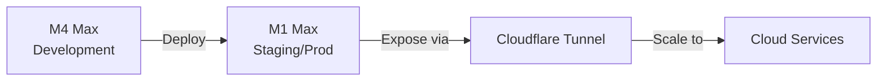

### MVP Target Devices

- Mac (Safari, Chrome)
- iOS - iPhone 15 Pro Max
- iPadOS - iPad Pro (older model)
- **Not targeting Android initially**

Mobile-first responsive web, no native app store deployment for MVP.

---

## Cloudflare Services Deep Dive

### Cloudflare D1 (SQLite at Edge)

| Tier | Storage | Reads/day | Writes/day | Cost |
|------|---------|-----------|------------|------|
| **Free** | 5GB | 5M | 100K | $0 |
| **Paid** | 5GB+ | Beyond free | Beyond free | $0.75/M reads, $1.00/M writes |

**Write budget concern:** 100K writes/day = ~70 writes/minute continuously

For a social app:
- Each post = 1+ writes
- Each like/interaction = 1 write
- AI responses = 1+ writes per user post

**Mitigation strategies:**
- Batch writes where possible
- Use KV for high-frequency updates (sessions, counters)
- Queue writes and flush periodically
- Keep D1 for durable data, not real-time counters

### Redis vs Cloudflare KV Comparison

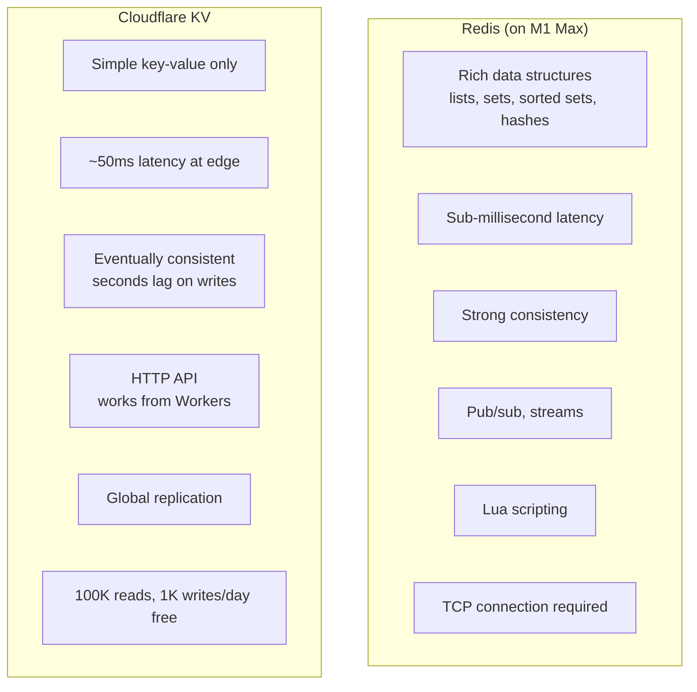

| Use Case | Best Choice | Why |
|----------|-------------|-----|
| Session storage | Redis (dev), KV (prod) | Sessions are simple KV, KV works globally |
| Feed caching | Redis | Need sorted sets, range queries |
| Rate limiting | Redis (local), KV (edge) | Redis for precision, KV for global edge |
| Real-time updates | Redis | Pub/sub support |
| User preferences | KV | Rarely changes, simple structure |
| Post counters | Redis → periodic sync to D1 | High write frequency |

**Recommendation:** Use both!
- **Redis on M1 Max** for development and local server operations
- **Cloudflare KV** for edge operations and Workers
- Learn KV now since you're using it for DollhouseMCP hosted service

### Supabase Clarification

**Supabase is NOT Google.** It's an independent company (YC-backed) building an open-source Firebase alternative on PostgreSQL.

However, given your preference to avoid new platform UI complexity and your existing Cloudflare experience, we can skip Supabase entirely:

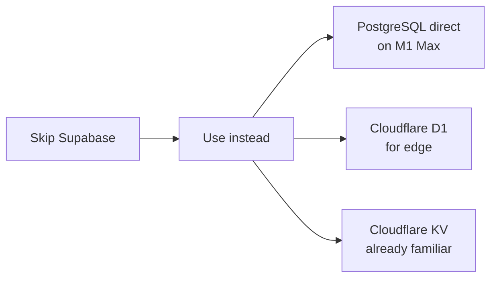

---

## Database Options

### Option 1: SQLite

A single-file database that runs embedded in your application.

| Aspect | Details |
|--------|---------|
| **Cost** | Free |
| **Complexity** | Extremely simple - just a file |
| **Performance** | Excellent for reads, limited write concurrency |
| **Scaling** | Single machine only, no replication |
| **Your Setup** | Perfect for dev, could work for small user base |

**Pros:**
- Zero configuration, zero maintenance
- Runs anywhere (dev machine, home server, even Cloudflare D1)
- Surprisingly capable - handles millions of rows fine
- Easy backups (it's just a file)
- No separate process to manage

**Cons:**
- Single writer at a time (concurrent writes queue up)
- No built-in replication/clustering
- Eventually need to migrate if you grow significantly
- No vector search built-in (would need separate solution)

**Best for:** MVP, development, small user base (<100 concurrent users)

---

### Option 2: PostgreSQL (Self-Hosted on M1 Max)

The industry standard relational database, running on your home server.

| Aspect | Details |
|--------|---------|
| **Cost** | Free (open source) |
| **Complexity** | Moderate - need to install/maintain |
| **Performance** | Excellent, handles high concurrency |
| **Scaling** | Can add read replicas, eventually shard |
| **Your Setup** | 32GB RAM is plenty for PostgreSQL |

**Pros:**
- Battle-tested, runs everything from startups to Fortune 500
- pgvector extension for AI embeddings/semantic search
- Full-text search built-in
- JSONB for flexible schema when needed
- Massive community, excellent tooling
- Easy migration path to managed services later

**Cons:**
- Need to manage backups, updates, monitoring
- More complex than SQLite
- Running on home server means uptime depends on your power/internet
- Need to secure it properly (though Cloudflare Tunnel helps)

**Best for:** Production-ready development, scaling to thousands of users

---

### Option 3: Cloudflare D1

SQLite-based database running on Cloudflare's edge network.

| Aspect | Details |
|--------|---------|
| **Cost** | Free tier: 5GB storage, 5M reads/day, 100K writes/day |
| **Complexity** | Very simple - managed by Cloudflare |
| **Performance** | Good, globally distributed |
| **Scaling** | Cloudflare handles it |
| **Your Setup** | Pairs naturally with your CF Workers experience |

**Pros:**
- Fully managed, no server maintenance
- Free tier is generous for development/small scale
- Globally distributed (low latency worldwide)
- Integrates seamlessly with Cloudflare Workers
- Automatic backups

**Cons:**
- SQLite limitations (write throughput)
- No vector search (would need separate solution)
- Vendor lock-in to Cloudflare
- Relatively new product (less mature than PostgreSQL)
- Some features still in beta

**Best for:** Cloudflare-native architecture, global distribution needs

---

### Option 4: Supabase (Managed PostgreSQL)

Hosted PostgreSQL with auth, real-time subscriptions, and more.

| Aspect | Details |
|--------|---------|
| **Cost** | Free tier: 500MB, then $25/mo for 8GB |
| **Complexity** | Very simple - fully managed |
| **Performance** | Good, dedicated instances available |
| **Scaling** | Supabase handles it |
| **Your Setup** | Good if you want managed, but costs money |

**Pros:**
- PostgreSQL with all its power
- Built-in auth (saves significant development time)
- Real-time subscriptions (live feed updates)
- pgvector included
- Nice dashboard, good DX
- Row-level security for multi-tenant

**Cons:**
- Free tier limited (500MB)
- Costs money at scale
- Another vendor dependency
- Less control than self-hosted

**Best for:** Fast development, need auth/realtime out of the box

---

### Option 5: Turso (Distributed SQLite)

SQLite replicated across edge locations, libSQL-based.

| Aspect | Details |
|--------|---------|
| **Cost** | Free tier: 9GB storage, 500M reads/mo, 25M writes/mo |
| **Complexity** | Simple - managed service |
| **Performance** | Good, read replicas at edge |
| **Scaling** | Automatic replication |
| **Your Setup** | Good middle ground |

**Pros:**
- SQLite simplicity with replication
- Generous free tier
- Edge replicas for fast reads globally
- Easy to start, familiar SQL

**Cons:**
- Still has SQLite write limitations
- Newer service, less proven
- No vector search built-in
- Less ecosystem than PostgreSQL

**Best for:** Want SQLite simplicity but need some distribution

---

### Database Recommendation

**For your situation, I'd suggest a phased approach:**

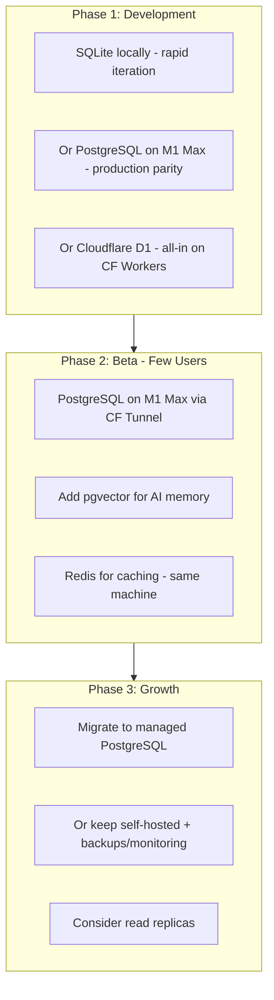

---

## Frontend Frameworks

### Option 1: Next.js

React-based framework with server-side rendering.

| Aspect | Details |
|--------|---------|
| **Learning Curve** | Moderate (need to know React) |
| **Performance** | Excellent (SSR, static generation, streaming) |
| **Ecosystem** | Massive (React ecosystem) |
| **Deployment** | Vercel (ideal), or self-host |

**Pros:**
- Industry standard, huge community
- App Router enables modern patterns (server components)
- Works great with Cloudflare (via next-on-pages or static export)
- Excellent TypeScript support
- React ecosystem (tons of UI libraries)

**Cons:**
- React has learning curve
- Can be complex (many ways to do things)
- Vercel-optimized (self-hosting is doable but less smooth)
- Bundle size can get large

---

### Option 2: SvelteKit

Svelte-based framework, compiles away the framework.

| Aspect | Details |
|--------|---------|
| **Learning Curve** | Lower than React |
| **Performance** | Excellent (minimal runtime) |
| **Ecosystem** | Smaller but growing |
| **Deployment** | Adapters for many platforms including Cloudflare |

**Pros:**
- Simpler mental model than React
- Smaller bundles (compiles to vanilla JS)
- Built-in stores for state management
- First-class Cloudflare Pages/Workers support
- Less boilerplate

**Cons:**
- Smaller ecosystem than React
- Fewer UI component libraries
- Less corporate adoption (fewer examples/tutorials)
- Team hiring harder (fewer Svelte devs)

---

### Option 3: Astro

Content-focused framework with island architecture.

| Aspect | Details |
|--------|---------|
| **Learning Curve** | Low |
| **Performance** | Excellent (ships zero JS by default) |
| **Ecosystem** | Growing, can use React/Svelte/Vue components |
| **Deployment** | Great Cloudflare support |

**Pros:**
- Ships minimal JavaScript (great for performance)
- Can use any UI framework for interactive parts
- Excellent for content-heavy sites
- Great Cloudflare Pages integration
- Simple to understand

**Cons:**
- Not ideal for highly interactive SPAs
- Island architecture can be awkward for app-like experiences
- Younger framework
- For a social media app, you'd need many islands

---

### Option 4: Remix

React-based, focused on web fundamentals.

| Aspect | Details |
|--------|---------|
| **Learning Curve** | Moderate |
| **Performance** | Excellent |
| **Ecosystem** | React ecosystem |
| **Deployment** | Many adapters including Cloudflare |

**Pros:**
- Web fundamentals (forms, HTTP) done right
- Great data loading patterns
- Works well with Cloudflare Workers
- Progressive enhancement built-in
- React ecosystem

**Cons:**
- Smaller community than Next.js
- Some churn in the project (Shopify acquisition)
- Fewer tutorials/examples
- React complexity still applies

---

### Option 5: Hono + htmx

Lightweight server framework with hypermedia.

| Aspect | Details |
|--------|---------|
| **Learning Curve** | Low |
| **Performance** | Excellent |
| **Ecosystem** | Minimal (by design) |
| **Deployment** | Perfect for Cloudflare Workers |

**Pros:**
- Extremely lightweight
- Hono is built for edge (Cloudflare Workers native)
- htmx = minimal JavaScript, server-rendered HTML
- Simple mental model
- Very fast iteration
- Great for prototyping

**Cons:**
- Less "app-like" feel without more JS
- Smaller ecosystem
- Not as many pre-built components
- May need to add more JS for real-time features

---

### Frontend Recommendation

**For your situation:**

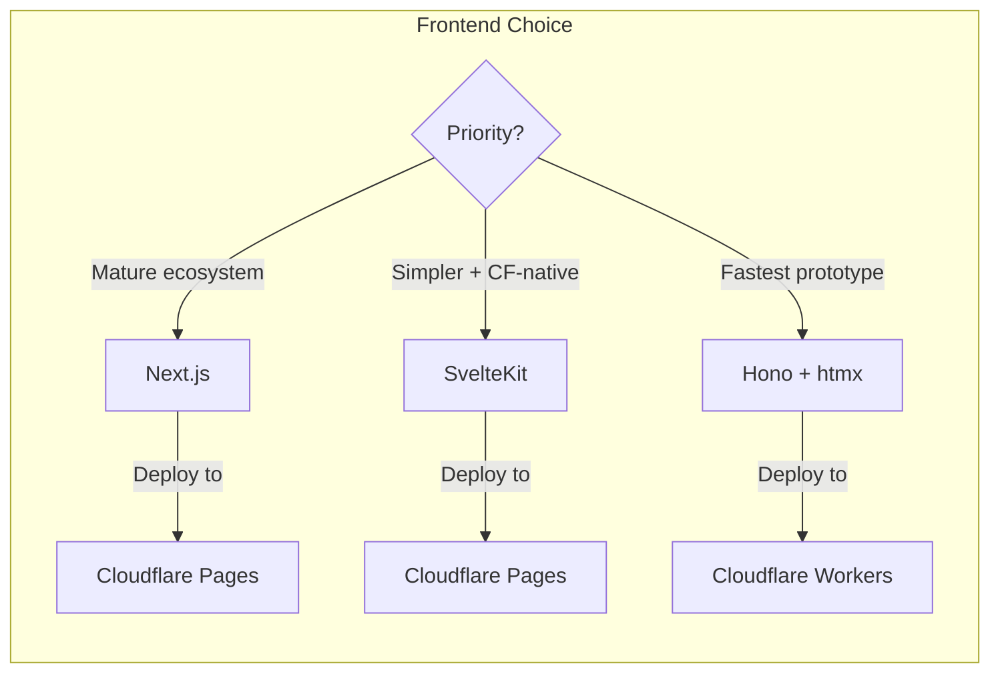

**My suggestion:** SvelteKit or Hono+htmx for your initial development. Both work great with Cloudflare, are simpler than React, and let you iterate quickly. SvelteKit if you want a more "standard" SPA feel, Hono+htmx if you want maximum simplicity.

---

## Backend / API Layer

### Option 1: Cloudflare Workers

Serverless functions at Cloudflare's edge.

| Aspect | Details |
|--------|---------|
| **Cost** | Free tier: 100K requests/day |
| **Cold Start** | Nearly instant (V8 isolates) |
| **Runtime** | JavaScript/TypeScript (V8) |
| **Your Setup** | You already know these! |

**Pros:**
- You already have experience with them
- Free tier is generous
- No cold starts (unlike AWS Lambda)
- Global distribution by default
- Pairs with D1, KV, Durable Objects, R2
- Hono framework is excellent for Workers

**Cons:**
- CPU time limits (50ms free tier, 30s paid)
- Memory limits (128MB)
- No native PostgreSQL driver (need HTTP-based like Neon)
- Some Node.js APIs not available
- Durable Objects needed for WebSockets (paid)

---

### Option 2: Node.js on Home Server

Traditional Node.js server on your M1 Max.

| Aspect | Details |
|--------|---------|
| **Cost** | Free (your hardware) |
| **Cold Start** | None (always running) |
| **Runtime** | Full Node.js |
| **Your Setup** | Already running Zulip there |

**Pros:**
- Full Node.js (all packages work)
- No limits on CPU/memory
- Direct PostgreSQL connection
- WebSockets are trivial
- Full control
- Already have Cloudflare Tunnel

**Cons:**
- Single point of failure (your home server)
- Need to manage uptime, updates
- Not distributed (latency for distant users)
- Your electricity/internet uptime matters

---

### Option 3: Hybrid (Workers + Home Server)

Use Workers at the edge, home server for heavy lifting.

| Aspect | Details |
|--------|---------|
| **Cost** | Free (mostly) |
| **Complexity** | Higher (two systems) |
| **Performance** | Best of both worlds |
| **Your Setup** | Leverages all your infrastructure |

**Architecture:**

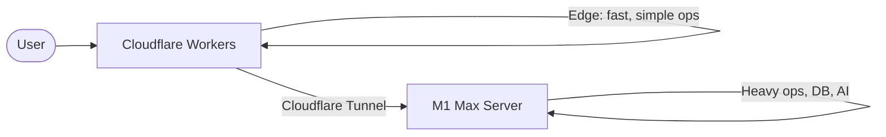

**Pros:**
- Edge performance for simple operations
- Full power for AI generation, complex queries
- Gradual migration path (move things to Workers over time)
- Resilient (some features work even if home server down)

**Cons:**
- More complex architecture
- Two deployment targets
- Need to decide what lives where

---

### Backend Recommendation

**For your situation:**

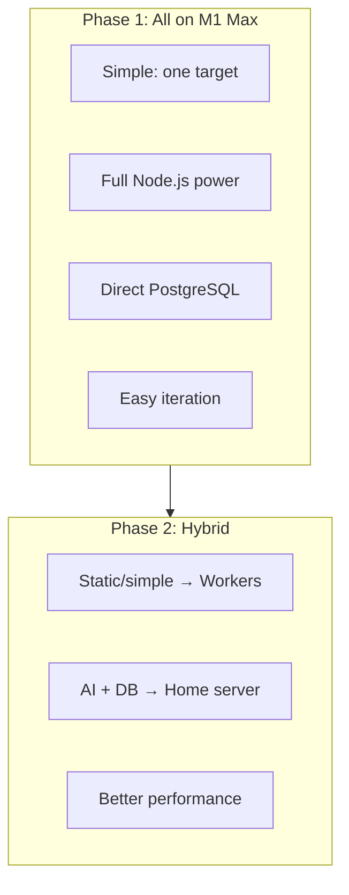

---

## Caching

### Option 1: No Cache (Start Here)

Just use the database directly.

**Pros:**
- Simplest possible architecture
- One source of truth
- No cache invalidation bugs

**Cons:**
- Database handles all load
- Slower for repeated queries

**Recommendation:** Start here. Add caching when you have actual performance problems.

---

### Option 2: Cloudflare KV

Key-value store at Cloudflare's edge.

| Aspect | Details |
|--------|---------|
| **Cost** | Free tier: 100K reads/day, 1K writes/day |
| **Latency** | Very low (edge) |
| **Consistency** | Eventually consistent |

**Pros:**
- Global distribution
- Pairs with Workers
- Free tier is reasonable
- Simple API

**Cons:**
- Eventually consistent (writes take seconds to propagate)
- Limited write rate on free tier
- Not good for frequently-changing data

**Good for:** User sessions, static config, infrequently-changed data

---

### Option 3: Redis on Home Server

In-memory data store running on M1 Max.

| Aspect | Details |
|--------|---------|
| **Cost** | Free |
| **Latency** | Sub-millisecond (local) |
| **Consistency** | Strong (single instance) |

**Pros:**
- Extremely fast
- Pub/sub for real-time
- Rich data structures (lists, sets, sorted sets)
- Great for rate limiting, sessions, queues

**Cons:**
- Memory-bound (uses RAM)
- Single point of failure
- Only accessible from home server

**Good for:** Hot data cache, real-time pub/sub, queues

---

### Option 4: Upstash Redis

Serverless Redis, accessible from anywhere.

| Aspect | Details |
|--------|---------|
| **Cost** | Free tier: 10K commands/day |
| **Latency** | Low (regional) |
| **Consistency** | Strong |

**Pros:**
- Works from Cloudflare Workers (HTTP-based)
- No server to manage
- Pay per request
- Global replication available

**Cons:**
- HTTP overhead (slightly slower than TCP Redis)
- Free tier limited
- Costs money at scale

**Good for:** Edge-compatible caching, rate limiting from Workers

---

### Caching Recommendation

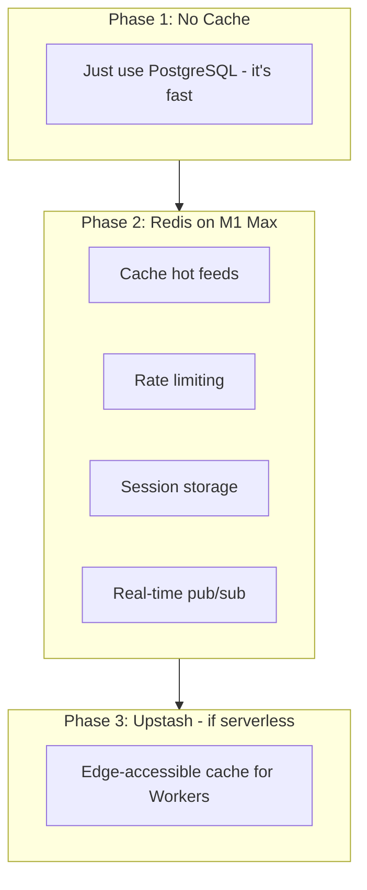

---

## AI Integration

### Multi-Provider Architecture

Support multiple LLM providers with pluggable API keys:

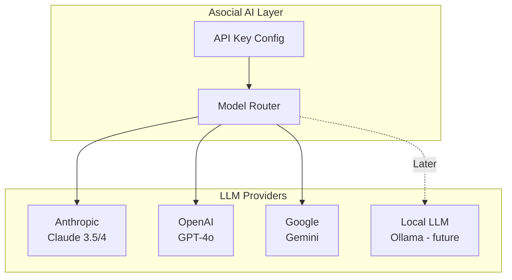

### Provider Comparison

| Provider | Fast Model | Balanced Model | Powerful Model | Input Cost (per 1M tokens) |
|----------|------------|----------------|----------------|---------------------------|
| **Anthropic** | Haiku (~$0.25) | Sonnet (~$3) | Opus (~$15) | Excellent quality |
| **OpenAI** | GPT-4o-mini (~$0.15) | GPT-4o (~$2.50) | GPT-4o (~$2.50) | Good tool use |
| **Google** | Gemini Flash (~$0.075) | Gemini Pro (~$1.25) | Gemini Ultra | Cheap, good for bulk |

### Task-to-Model Mapping

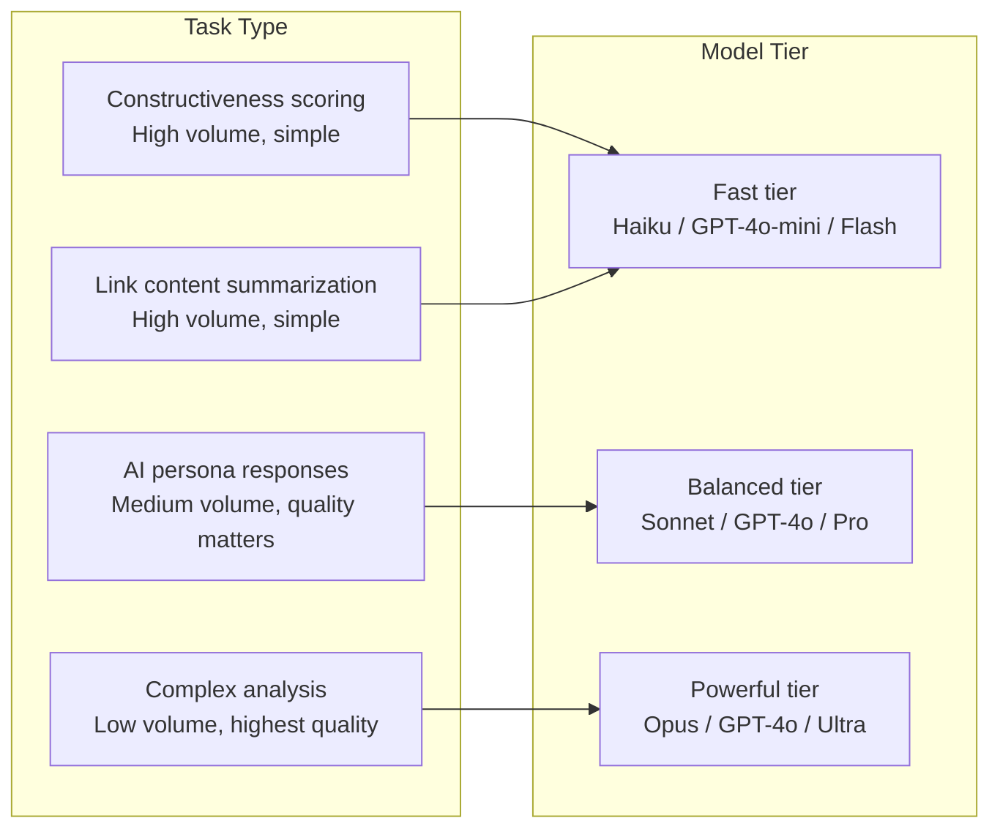

### Why APIs First, Local Later

**Your observation is spot-on:** During development, local LLMs require constant "massaging" due to behavior quirks, which distracts from actual development work.

**Recommended approach:**

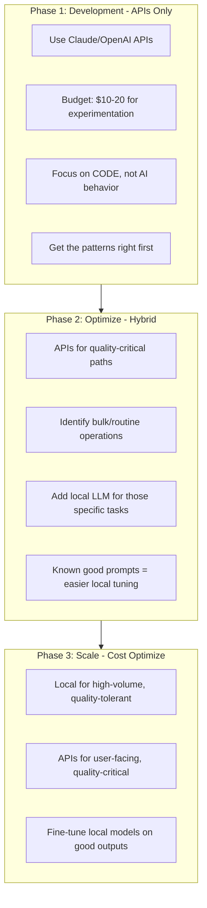

### Configuration Interface

```typescript
interface AIConfig {
  providers: {
    anthropic?: {
      apiKey: string
      defaultModel: 'haiku' | 'sonnet' | 'opus'
    }
    openai?: {
      apiKey: string
      defaultModel: 'gpt-4o-mini' | 'gpt-4o'
    }
    google?: {
      apiKey: string
      defaultModel: 'flash' | 'pro' | 'ultra'
    }
    local?: {
      baseUrl: string  // e.g., http://localhost:11434
      defaultModel: string
    }
  }

  // Task routing
  routing: {
    constructiveness_scoring: { provider: string, tier: 'fast' | 'balanced' | 'powerful' }
    persona_response: { provider: string, tier: 'fast' | 'balanced' | 'powerful' }
    content_analysis: { provider: string, tier: 'fast' | 'balanced' | 'powerful' }
    link_summarization: { provider: string, tier: 'fast' | 'balanced' | 'powerful' }
  }

  // Budget controls
  budget?: {
    daily_limit_usd: number
    alert_threshold_usd: number
  }
}
```

### Estimated Costs (Development Phase)

| Task | Volume/day | Model | Cost/day |
|------|-----------|-------|----------|
| Constructiveness scoring | 100 posts × 500 tokens | Haiku | ~$0.01 |
| Persona responses | 100 responses × 1000 tokens | Sonnet | ~$0.30 |
| Link summarization | 50 links × 2000 tokens | Haiku | ~$0.03 |
| **Total** | | | **~$0.34/day** |

At $10-20 experimentation budget, you have **30-60 days** of active development before needing to optimize.

---

## Hosting Summary

### Recommended Architecture for Your Situation

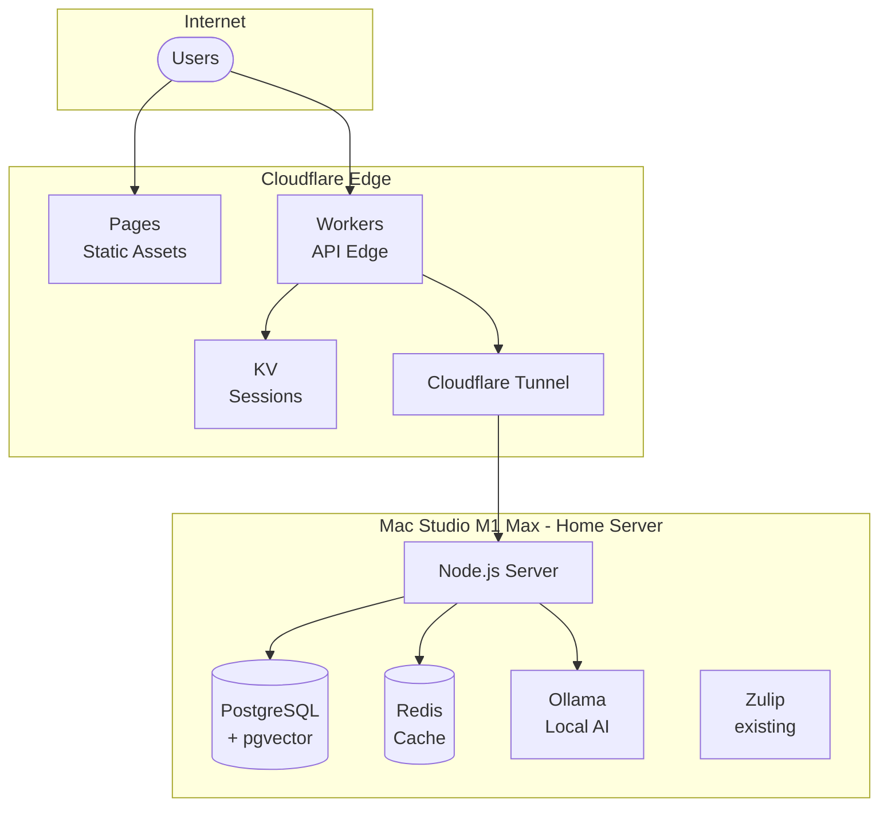

### Cost Breakdown (Initial Phase)

| Component | Cost |
|-----------|------|
| Cloudflare Pages | Free |
| Cloudflare Workers | Free (100K req/day) |
| Cloudflare KV | Free tier |
| Cloudflare Tunnel | Free |
| PostgreSQL (self-hosted) | Free |
| Redis (self-hosted) | Free |
| Ollama (self-hosted) | Free |
| Claude API (when needed) | ~$5-20/mo estimate |
| **Total** | **~$5-20/mo** |

### Path to Production Scale

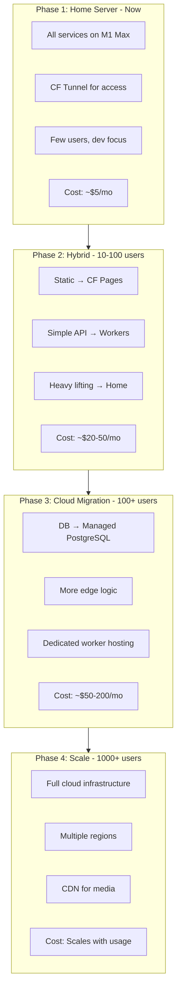

---

## Recommended Starting Stack

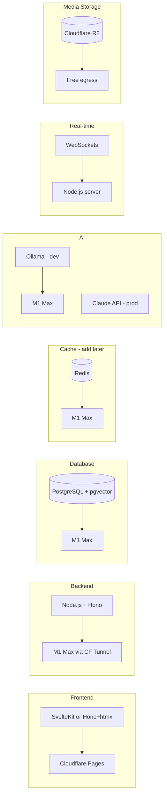

**This gives you:**


