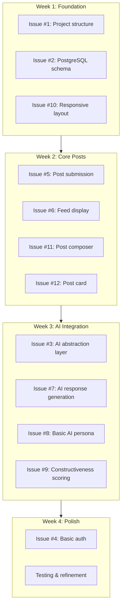

# Session Notes: 2024-12-28 - Project Setup and Planning

## Session Summary

Initial project setup for **Asocial**, a constructive social media platform. Established repository, documentation, architecture decisions, and created GitHub issues/milestones for the development roadmap.

## What We Accomplished

### 1. Repository Setup
- Created GitHub repo: https://github.com/mickdarling/asocial
- Added AGPL-3.0 license
- Created initial README with project vision

### 2. Core Concept Documentation

**The Big Idea:**
- Anti-propaganda social network creating constructive feedback loops
- Users post content, always get AI responses
- Constructive posts get bridged to real social media (Twitter, Mastodon, Bluesky)
- AI personas (clearly tagged as bots) populate the feed with helpful content
- Periodic propaganda technique education delivered naturally through AI conversations
- Interchangeable UI (Twitter/Facebook/Instagram/TikTok styles)

**Key Rules Established:**
- AI never fabricates content - all links validated, content verified
- AI posts stay internal UNLESS user shares with constructive comment
- Shared AI posts clearly attributed as AI-generated
- Constructive ≠ Positive - can discuss problems helpfully

### 3. Technical Design Document (`docs/TECHNICAL_DESIGN.md`)

Created comprehensive technical spec including:
- Entity Relationship Diagram (Mermaid)
- Data models: User, Post, AIPersona, Interaction, Share
- Federation design (ActivityPub + AT Protocol)
- AI System Architecture with MCP client integration
- AI Worker context requirements
- Data flow sequence diagrams

### 4. Technology Choices Document (`docs/TECHNOLOGY_CHOICES.md`)

Analyzed options and made decisions:

| Component | Choice | Rationale |
|-----------|--------|-----------|
| **Database** | PostgreSQL on M1 Max | Full power, pgvector for AI memory |
| **Cache** | Redis (local) + Cloudflare KV (edge) | Use both - Redis for complex ops, KV for edge |
| **Frontend** | SvelteKit or Hono+htmx | Simpler than React, good CF support |
| **Backend** | Node.js on M1 Max via CF Tunnel | Full Node power, easy iteration |
| **AI** | Multi-provider (Anthropic/OpenAI/Google) | APIs first, local LLM later |
| **Media** | Cloudflare R2 | Free egress, S3-compatible |

**Development Flow:**
```
M4 Max (dev) → M1 Max (staging via CF Tunnel) → Cloud (scale)
```

**MVP Targets:** Mac, iPhone 15 Pro Max, iPad Pro (no Android initially)

### 5. GitHub Project Management

**Milestones Created:**
1. Proof of Concept - Single user, local dev, core features
2. Beta Launch - Multi-user, DollhouseMCP, home server deployment
3. Production Ready - Full federation, PWA, multiple UI themes
4. Scale - Cloud migration, optimization, multi-region

**Issues Created:** 38 total across all milestones

**Labels Created:** infrastructure, database, ai, poc, feature, auth, posts, feed, personas, ui, deployment, beta, caching, mcp, media, content, education, interactions, sharing, federation, production, themes, mobile, performance, scale

## Key Decisions Made

1. **DollhouseMCP Integration** - AI personas will use DollhouseMCP persona spec, system acts as MCP client
2. **APIs First** - Use Claude/OpenAI APIs during development ($10-20 budget), local LLM later
3. **Skip Supabase** - Stick with PostgreSQL direct + Cloudflare services (already familiar)
4. **D1 Write Budget** - Be strategic with 100K writes/day limit, use KV for counters
5. **Responsive Web** - No native app initially, mobile-first PWA approach

## Architecture Diagrams Created

All converted to Mermaid format:
- Database hybrid approach (PostgreSQL + Redis + pgvector)
- Entity Relationship Diagram
- Federation flows (ActivityPub, AT Protocol)
- Hosting architecture (Cloudflare Edge → CF Tunnel → M1 Max)
- Data flow sequences (post creation, feed loading, AI generation)
- AI system architecture (MCP client, provider abstraction)
- Scaling path visualization

## Files in Repository

```
asocial/
├── README.md                           # Project overview and vision
├── LICENSE                             # AGPL-3.0
└── docs/
    ├── TECHNICAL_DESIGN.md             # Data models, architecture, flows
    ├── TECHNOLOGY_CHOICES.md           # Stack decisions with pros/cons
    └── session-notes/
        └── session-notes-2024-12-28-project-setup-and-planning.md
```

## Next Session: Start PoC Development

### Recommended Starting Point

Begin with **Issue #1: Set up project structure** and **Issue #2: Set up PostgreSQL with basic schema**

### Suggested Order for PoC



### Before Next Session

- [ ] Decide: SvelteKit vs Hono+htmx for frontend
- [ ] Have Anthropic/OpenAI API keys ready
- [ ] Ensure PostgreSQL is installed on M4 Max (or ready to install)

### Questions to Consider

1. Do we want to start with a specific UI style (Twitter-like) or build generic first?
2. Should the first AI persona have a specific personality, or keep it generic for testing?
3. Any preference on the project structure (monorepo vs separate frontend/backend)?

## Session Stats

- **Duration:** ~2 hours
- **Commits:** 6
- **Documents created:** 3 (README, TECHNICAL_DESIGN, TECHNOLOGY_CHOICES)
- **GitHub issues:** 38
- **GitHub milestones:** 4
- **Mermaid diagrams:** 20+

---

*Session conducted with Claude Code (Opus 4.5)*
